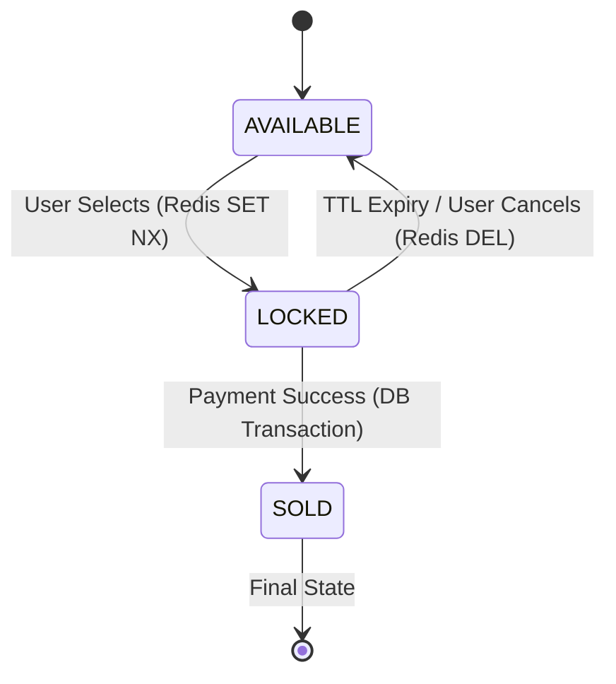

# Data Model: High-Demand Ticketing Platform

## 1. PostgreSQL Schema (Source of Truth)

The relational database maintains the permanent state of seats and the record of all successful transactions.

### `seats` table
Maintains the master list of all physical seats and their final availability.

| Column | Type | Description |
| :--- | :--- | :--- |
| `id` | `UUID` | Primary Key. |
| `section` | `VARCHAR` | Venue section (e.g., "North Stand"). |
| `row` | `INTEGER` | Row number. |
| `number` | `INTEGER` | Seat number within the row. |
| `status` | `ENUM` | Current state: `AVAILABLE`, `LOCKED`, `SOLD`. |
| `x`, `y` | `DECIMAL` | Visual coordinates for the interactive map. |
| `price` | `DECIMAL` | Cost of the ticket. |
| `updated_at` | `TIMESTAMP`| Last state change timestamp. |

### `sales` table
Records finalized purchases.

| Column | Type | Description |
| :--- | :--- | :--- |
| `id` | `UUID` | Primary Key. |
| `seat_id` | `UUID` | Foreign Key to `seats.id` (Unique). |
| `user_id` | `UUID` | Identifier for the purchaser. |
| `transaction_id`| `VARCHAR` | External payment gateway reference. |
| `amount` | `DECIMAL` | Final price paid. |
| `created_at` | `TIMESTAMP`| Purchase timestamp. |

### `outbox_events` table
Used for the Transactional Outbox Pattern to ensure reliable real-time updates.

| Column | Type | Description |
| :--- | :--- | :--- |
| `id` | `BIGINT` | Primary Key (Serial). |
| `event_type` | `VARCHAR` | e.g., `seat.locked`, `seat.sold`, `seat.released`. |
| `payload` | `JSONB` | Data required by the real-time layer. |
| `processed_at` | `TIMESTAMP`| NULL if pending, timestamp when broadcasted. |
| `created_at` | `TIMESTAMP`| Event creation time. |

---

## 2. Redis Structures (Ephemeral & Performance Layer)

Redis handles high-concurrency contention and provides a fast cache for real-time broadcasts.

### `locks:{seat_id}` (String)
Used for atomic mutual exclusion during the 10-minute reservation window.
- **Key**: `locks:seat_123`
- **Value**: `user_456` (The User ID who holds the lock)
- **TTL**: 600 seconds (10 minutes)
- **Operation**: `SET locks:{id} {user_id} NX EX 600`

### `map_state` (Hash)
A flattened representation of the entire seat map for O(1) status lookups during SSE broadcasts.
- **Key**: `map_state`
- **Field**: `{seat_id}`
- **Value**: JSON string containing `{ "status": "LOCKED", "u": "user_456" }`

---

## 3. Entity Relationships & State Transitions

### Relationships
- **Seat 1:1 Sale**: A seat can have at most one sale.
- **Seat 1:0..1 Lock**: A seat can have at most one active lock in Redis.
- **Sale 1:N Outbox**: A sale creation triggers an outbox entry.

### State Transitions

1.  **Locking**: Happens primarily in Redis for speed. The DB `seats.status` remains `AVAILABLE` or is updated asynchronously for consistency.
2.  **Purchase**: Must be a DB transaction. 
    - Update `seats.status = 'SOLD'` where `id = ? AND status = 'AVAILABLE'`.
    - Insert into `sales`.
    - Insert into `outbox_events`.
    - Cleanup Redis lock.
3.  **Expiry**: Handled by Redis `EXPIRE` notification or periodic reconciliation.
